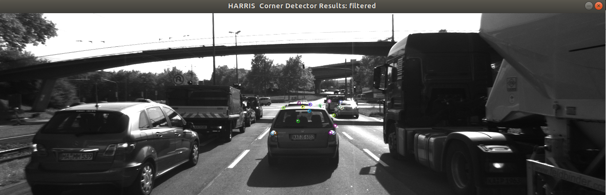
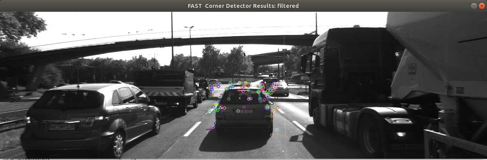
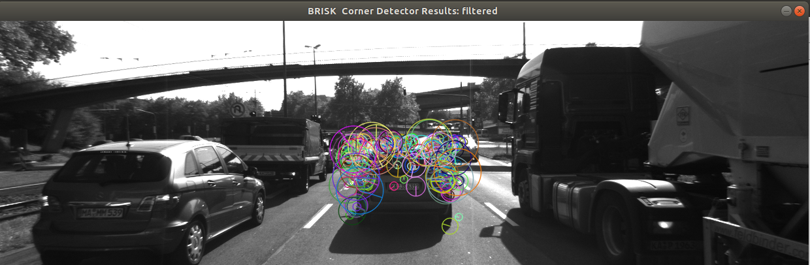
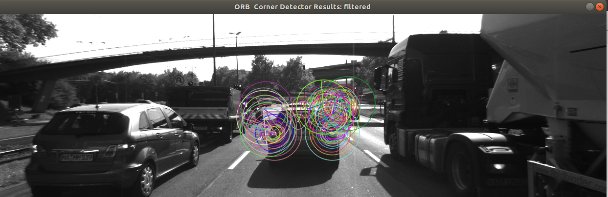
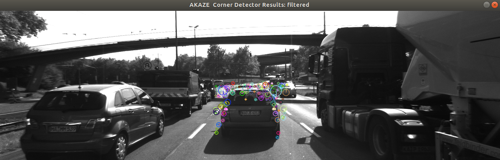
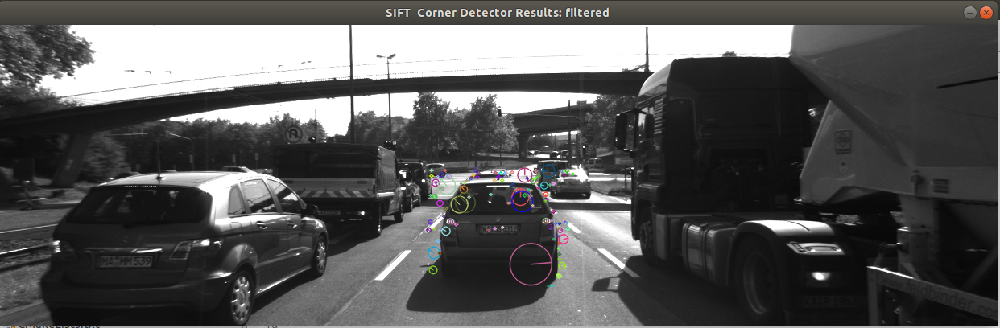
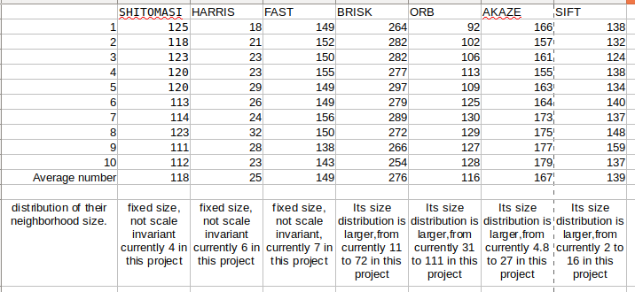
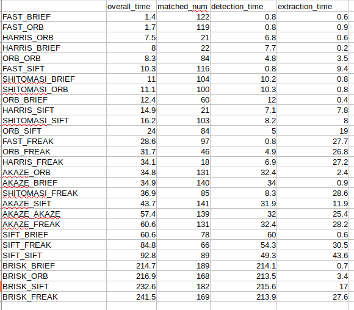

# SFND 2D Feature Tracking

Course project for Udacity Sensor Fusion Engineer Nanodegree Program

Build a suitable image feature tracking pipeline which will be finally used in object tracking, via exprimenting various detector/descriptor/Matcher combinations to see which ones perform best. 

Below are a high level introduction on major components of this feature tracking pipeline.

## Data Buffer

A ring buffer is a fixed size buffter that would overwrite old data if buffer capacity is reached. 

In this project, a simplifed version of ring buffer is implemented, in that the buffer only exposes interfaces for adding data, and does not expose interfaces for remove data. But this implementation suffice the needs of this project, as we only push new image frame related data to the buffer.

The ring buffer is implemented in the `RingBuffer` class template in RingBuffer.h. it mainly use a head and tail pointer to keep track of where to add data. See RingBuffer.h for implementation details.

## Keypoints

Keypoints in the whole iamge are extracted, and then only the keypoints in area around preceding vehicle are retained.

### Keypoint Detection
SHITOMASI, HARRIS, FAST, BRISK, ORB, AKAZE, and SIFT keypoint detector are implemented with OpendCV API, and they are selectable in the pipeline via variable `detectorType`.

###  Keypoint Removal

We then use a fixed rectange to fitler out keypoints that are within the neighbourhood of the preceding cars. The result for various detectors are as below,

1) SHITOMASI 

2) HARRIS 

3) FAST 

4) BRISK 

5) ORB 

6) AKAZE 

7) SIFT 

## Descriptors

For each keypoint obtained in current frame, we extract its corresponding feature descriptors. then we match previous frame to current frame based on the descriptors. Descriptor distance ratio is used to filter out likely incorrect matches.

### Keypoint Descriptors
BRIEF, ORB, FREAK, AKAZE, SIFT keypoint descriptors are implemented, and they ar selectabel by variabel `descriptorType`. 
### Descriptor Matching
Brute force matching and FLANN matching are both implemented, and are selectabel by variable `matcherType`.
### Descriptor Distance Ratio
In an attempt to fitler out mismatch(especially scense with repeated texture), desriptor distance ratio test is implemented. It use k nearest neighbour, find the ratio of best and second best match. If the ratio is above a certain threshold (like 0.8), we would say these two matches are too close, and won't be certain that we are making the right match if we just pick the best match.
## Performance

For the varios detector and descriptor combination, we evalaute their performance by the matched keypoints number, and matching speed. Please note that the detector and descriptor are mostly using OpenCV default parameters in current project, and if custorm parameters are applied, below statistics will certainly change.  
### Keypoints Detection Number
As mentioned above, SHITOMASI, HARRIS, FAST, BRISK, ORB, AKAZE, and SIFT keypoint detector are implemented. The number of keypoints on the preceding vehicle for all 10 image as below.  

Regarding the  distribution of keypoint neighborhood size, SHITOMASI, HARRIS, and FAST are all fixed and are scale variant. the remaining detectors are scale invariant, and the keypoint size are adjustable by input parameters.  

I also notice that, for all detectors, some of the keypoints dectors are not really on the vehicles, this could be an issue we might have to deal with in the following object tracking project.

### Keypoints Matching Number and time

For all possible combinations of detectors and descriptors, Below are the matched keypoint nubmer and time. Note that the combination listed by the asceding order of speed. In the matching step, the BF approach is used with the descriptor distance ratio set to 0.8.

Recommended combinations for our purpose of detecting keypoints on vehicles are:

1) FAST-BRIEF  
FAST detector and BRIEF descriptor combination is recommended as it's the fastest, and takes only 1.4 ms for both keypoint detection and descriptor extraction. Its disadvantage is that is not scale and orientation invariant.  
2) ORB-ORB   

ORB-ORB is very fast too. its scale and orientation invariant.  

3) FAST-SIFT  

FAST-SIFT (13ms) is fast enough for our vehicle tracking purpose, at the same, as SIFT desciptor use HOG, which is proven effective in object tracking, this combination is worth being further examined too.   

## Refelction

This project does an interesting job of thoroughly experimenting all important components of feature tracking, including keypoint detector, descriptor, and matcher. Based the experimentation data, three top detector/descriptor are recommended for the vehicle tracking in following project. Currenlty the evaluation metric are strictly about matched points number and speed, this preclues another critical factor out of the picture, matching accuracy. I am excited to put the result of this project into use in the next object tracking project, and see how the detector/descriptor combinations goes. 

